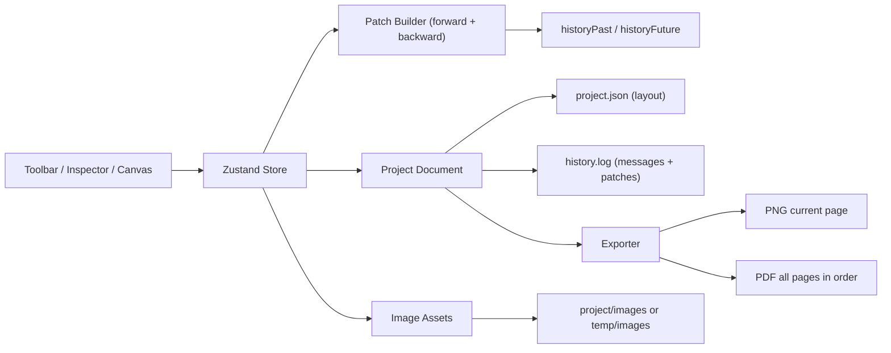

<div align="center">

<h1>OpenKoma</h1>

<p><strong>Local-First AI Comic Editor</strong><br/>A reproducible open-source workflow for comic panel layout, image composition, and incremental editing history.</p>

<p>
  
  
  
  
  
</p>

<p>
  
  
  
  
  
</p>

</div>

## Abstract
OpenKoma is a local-first comic creation environment focused on practical production workflows: panel composition, bubble editing, non-destructive local image import + cropping, reversible operations, multi-page management, and high-fidelity export.

Unlike many demo-grade tools, OpenKoma persists both structure (`project.json`) and operation history (`history.log`) so that editing intent can be reconstructed and replayed across sessions.

## Contributions
1. Incremental reversible editing via JSON Patch (`undo/redo` based on forward/backward patches).
2. Non-destructive image workflow: original image is preserved, display uses crop metadata only.
3. Multi-page pipeline with sortable page list and ordered multi-page PDF export.
4. Project persistence split into layout and history, improving clarity and long-term maintainability.
5. Local-first strategy with graceful fallback when file-system picker APIs are unavailable.

## Method Overview


## Core Features
- Canvas presets and custom dimensions (A4/A3 + manual size).
- Panel operations: split grid, draw-by-drag, drag/resize, per-panel style, global style one-click apply.
- Bubble system: rectangle/rounded/circle with horizontal and vertical text.
- Local image import and manual crop editor:
  - Crop box keeps panel aspect ratio.
  - Drag inside to move; drag edges to resize.
  - After panel resize, crop is auto-adjusted while keeping center priority.
- 16-multiple snapping mode during resize/transform.
- Multi-page list: add/delete/reorder/switch pages.
- Incremental action messages shown in status area; undo/redo references operation intent.
- Export:
  - PNG: current page.
  - PDF: all pages in current order.
- Theme support: light/dark mode via Radix UI switch.

## Reproducibility
### Environment
- Node.js 18+
- npm 9+

### Setup
```bash
npm install
npm run dev
```

Default endpoints:
- Web: `http://localhost:5173`
- API: `http://localhost:3001`

### Build Check
```bash
npm run build
```

## Optional Environment Variables
Create `.env` in repository root:

```bash
PORT=3001
AI_IMAGE_API_URL=
AI_IMAGE_API_KEY=
```

Behavior:
- If `AI_IMAGE_API_URL` is empty, `/api/generate` returns a local SVG placeholder for offline development.
- If configured, prompt payload is forwarded and response images are materialized as local assets.

## Storage Format
A saved project directory contains:

```text
<project-root>/
├── project.json      # layout document: canvas/pages/panels/bubbles/assets refs
├── history.log       # operation log: messages + incremental history patches
└── images/           # imported/generated source images
```

For unsaved work, temporary snapshots are stored under:

```text
project/temp/<projectId>/
```

If directory-picker APIs are not available in runtime environment, save/load falls back to:

```text
./project/project.json
./project/history.log
./project/images/*
```

## API Snapshot
### `POST /api/generate`
Input:
```json
{
  "prompt": "comic storyboard, rainy cyberpunk street",
  "negativePrompt": "",
  "width": 1024,
  "height": 768
}
```

Output:
```json
{
  "url": "/assets/images/xxx.png",
  "naturalWidth": 1024,
  "naturalHeight": 768
}
```

### `POST /api/images/upload`
- Upload a local file and receive a local asset URL plus natural size metadata.

### `POST /api/project/save` and `GET /api/project/load`
- Fallback persistence APIs used when browser path-picking is not supported.

## Roadmap
- PSD layered export.
- Multi-select and batch align/distribute.
- Template packs for manga/comic layout presets.
- More advanced typography and bubble tail editing.

## Citation
If this project helps your research or tooling, you can cite it as:

```bibtex
@software{openkoma2026,
  title = {OpenKoma: A Local-First AI Comic Editor with Incremental Reversible History},
  author = {OpenKoma Authors},
  year = {2026},
  url = {https://github.com/<your-org>/OpenKoma},
  license = {Apache-2.0}
}
```

## Acknowledgements
- React, Konva, Zustand, Vite, Express, fast-json-patch, jsPDF, Radix Themes.

## License
This repository is licensed under the Apache License 2.0.

See [LICENSE](./LICENSE) for the full text.
